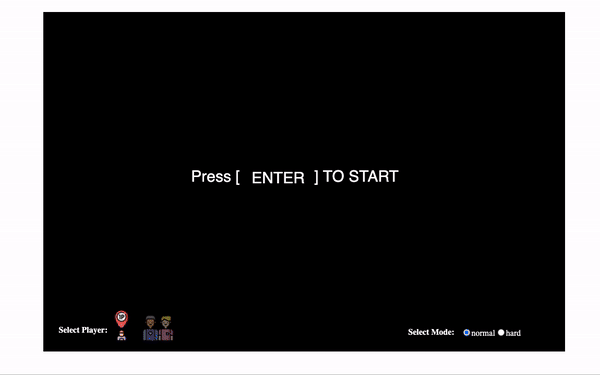

# Space Invader Game
Build my own simple space invader game to improve my programming skill while exploring the usage of object-oriented programming design
to create different objects in this project

## Features

1. Mode Selection (Easy, hard)
2. Collision Detection algorithm (laser hit alien, alien hit ship, laser rebound)
3. Players Selection (1P, 2P)
4. Music and sound effects
5. Score tabulation

## Getting Started
1. Download project folder
2. Run command `node server.js` in project folder
3. Access localhost in browser to play the game

## Keys
- Player One: Move Left: A, Move Right: D, Shoot: S
- Player Two: Move Left: L, Move Right: ', Shoot: ;
- Mode: Normal (N), Hard (H)
- Player: 1P (Player 1), 2P (Player 2)

## Object Oriented Design
Objects with similar properties and behaviors are initially defined as classes, serving as blueprints to create various instances. This approach promotes code reusability, allowing us to create multiple objects based on the class template and customize their behavior and properties as needed. Examples of this can be found in classes like Alien, Brick, and Laser.

## Collision Detection Algorithm 
The Collision Detection Algorithm relies on a simple math formula using the Euclidean distance (also known as the straight-line distance or L2 norm) to measure the shortest distance between any two points. By utilizing the x and y coordinates of these points, we can easily calculate the distance using the JavaScript dist() function.

To determine whether the laser has collided with an entity (such as a ship or aliens), we compare the sum of the laser’s radius and the entity’s radius to the calculated distance between them. If the sum of the radii is greater than or equal to the distance, it indicates a collision, as their areas have overlapped.

## Demo

### 1P Normal Mode

### 2P Hard Mode

